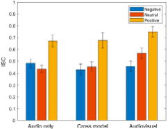
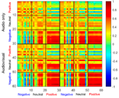

For a full list, see my [Google Scholar](https://scholar.google.com/citations?user=Op0POqIAAAAJ&hl=en) profile.

---

## Journal Articles

**2025**

Ma, T., **Kim, I.**, Varastegan, S., Yang, L., Golding, J., & Zhang, W. (2025). [Attention is Still a Productive Framework.](https://www.cambridge.org/core/journals/behavioral-and-brain-sciences/article/abs/attention-is-still-a-productive-framework/3B5B7035DF40617DA70C350E3DC925D6) *Behavioral and Brain Sciences*, 48, e148.

---

**2024**

Xie, W., Ma, T., Thakurdesai, S., **Kim, I.**, & Zhang, W. (2024). [Discrimination of mnemonic similarity is associated with short-term and long-term memory precision.](https://link.springer.com/article/10.3758/s13421-024-01648-y) *Memory & Cognition*, 1–13.

**Kim, I.**, & Kim, J. (2024). Affective Representation of Behavioral and Physiological Responses to Emotional Videos using Wearable Devices. *The Korean Journal of Emotion & Sensibility*.

---

**2023**

**Kim, I.**, Kim, H., & Kim, J. (2023). [Examining the consistency of continuous affect annotations and psychophysiological measures in response to emotional videos.](https://www.sciencedirect.com/science/article/abs/pii/S016787602300507X) *International Journal of Psychophysiology*, 193, 112242.

Park, C., **Kim, I.**, & Kim, J. (2023). Affective representations of basic tastes and intensity using multivariate analyses. *The Korean Journal of Emotion & Sensibility*, 26(2), 39–52.

---

**2022**

**Kim, I.**, Kim, H., Jang, J., & Kim, J. (2022). Measuring consistency of affective responses to ASMR stimuli across individuals using intersubject correlation. *The Korean Journal of Cognitive and Biological Psychology*, 34(2), 121–133.

::: {.pub-figures-row}

:::

**Kim, I.**, & Park, C. (2022). The influence of perceptual load on target identification and negative repetition effect in post-cueing forced choice task. *Korean Journal of Cognitive Science*, 33(1), 1–22.

---

## Conference Presentations

**2026**

Ma, T., **Kim, I.**, Punzalan, D., & Zhang, W. (May 2026). Revisiting evidence against the discrete-capacity account of STM limits: objective guessing obscured by representational modeling. Poster presented at the Annual Conference of the Vision Science Society, St. Pete Beach, FL.

**Kim, I.**, Ma, T., Liu, L., & Zhang, W. (May 2026). Dissociating Strength and Precision in Working Memory Representations: An Integrated Modeling Approach. Poster presented at the Annual Conference of the Vision Science Society, St. Pete Beach, FL.

---

**2025**

**Kim, I.**, Won, B.Y., Acebo, A., & Zhang, W. (May 2025). Direct Competition Between Hippocampal Pattern Separation and Short-Term Memory Precision. Poster presented at the Annual Conference of the Vision Science Society, St. Pete Beach, FL.

---

**2024**

**Kim, I.**, & Zhang, W. (May 2024). Visual working memory for configural information. Poster presented at the Annual Conference of the Vision Science Society, St. Pete Beach, FL.

---

**2022**

**Kim, I.**, & Kim, J. (November 2022). Intersubject correlation of physiological responses to discrete emotions. Poster presented at Psychonomics, Boston, MA.

Lee, S., **Kim, I.**, & Kim, J. (April 2022). Comparison between standard deviation and inter-subject correlation as individual consistency measures using continuous emotional stimuli. Poster presented at the Annual Conference of the Society and Affective Science, Virtual.

---

**2021**

**Kim, I.**, Jang, J., & Kim, J. (November 2021). Measuring consistency between individuals of affective responses to ASMR stimuli using inter-subject correlation. Talk presented at the International Conference of Korean Emotion and Sensibility Society, Virtual.

Lee, B., Gho, H., Cho, E., **Kim, I.**, Kim, H., & Kim, J. (August 2021). Effects of pleasant and unpleasant ASMR on working memory. Poster at the Annual Meeting of Korean General Psychology Society, Virtual.

Choi, Y., Choi, S., Lee, B., **Kim, I.**, & Kim, J. (August 2021). The effect of olfactory stimulation on emotional stability and working memory. Poster at the Annual Meeting of Korean General Psychology Society, Virtual.

Gho, H., Choi, E., Kim, H., Jang, J., **Kim, I.**, & Kim, J. (August 2021). The differences in emotional experience by modality of ASMR. Poster at the Annual Meeting of Korean General Psychology Society, Virtual.

**Kim, I.**, Ji, S., & Park, C. (August 2021). The effect of auditory ASMR stimuli on the performance in the emotional Stroop task. Poster at the Annual Meeting of Korean General Psychology Society, Virtual.

---

**2020**

**Kim, I.**, & Park, C. (August 2020). The influence on negative repetition effect of perceptual load. Poster at the Annual Meeting of Korean Cognitive and Biological Psychology Society, Virtual.
